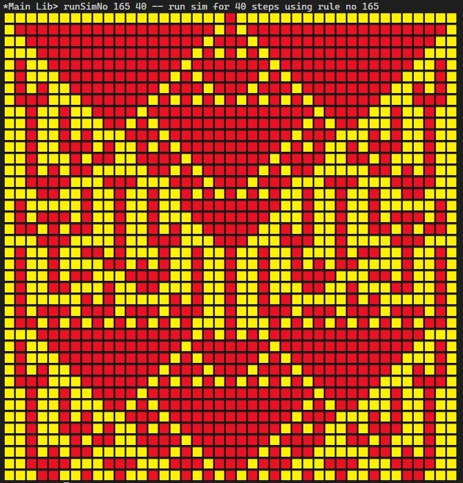

# Cellular-Automata

Simulates [elementary one-dimensional cellular automata](https://mathworld.wolfram.com/ElementaryCellularAutomaton.html), and prints output to console with unicode:
Example rule set

```
🟨🟨🟨 -> 🟥
🟨🟨🟥 -> 🟥
🟨🟥🟨 -> 🟥
🟨🟥🟥 -> 🟨
🟥🟨🟨 -> 🟨
🟥🟨🟥 -> 🟥
🟥🟥🟨 -> 🟨
🟥🟥🟥 -> 🟥
```

generates



